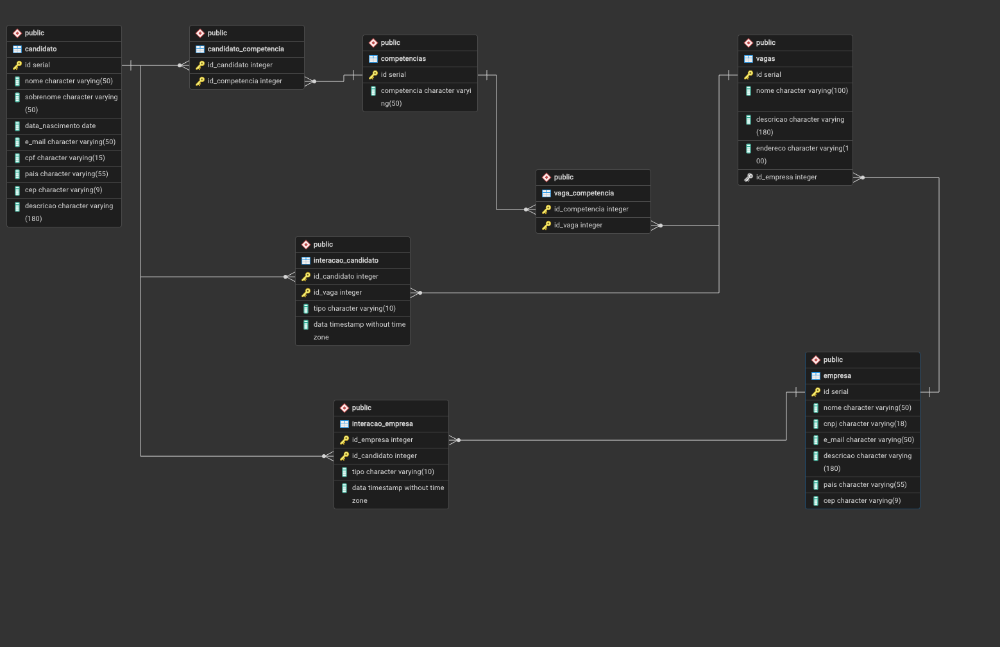

# Linketinder-Project

Projeto **Linketinder**, composto por um backend em **Groovy**, uma interface frontend em **TypeScript** e um banco de dados **PostgreSQL**.

## Tecnologias

- Backend: Groovy 5.1.1, Gradle 9.6.0, PostgreSQL JDBC
- Testes do backend: Spock 2.4 e JUnit Platform
- Frontend: TypeScript, Vite e Chart.js
- Banco de dados: PostgreSQL

## Estrutura

```text
Backend_Linketinder-Groovy/
├── src/main/groovy/org/linketinder/
│   ├── Main.groovy
│   ├── database/   # conexão JDBC
│   ├── dao/        # acesso a candidatos, empresas, vagas e competências
│   ├── model/      # modelos de domínio
│   ├── services/   # regras e operações do domínio
│   └── ui/         # menu e formulários de terminal
├── src/main/resources/db.properties
└── src/test/groovy/

Frontend_linketinder-TypeScript/
├── index.html
└── src/
    ├── main.ts
    ├── model/
    ├── repository/
    ├── service/
    ├── utils/
    └── style.css

DB_Linketinder/
├── Linketinder_BD.sql
└── modelo_bd.png
```

## Backend

O backend é uma aplicação de terminal em Groovy com persistência em PostgreSQL via JDBC. O fluxo começa em `Main.groovy`, que inicia o menu em `ui/`. Formulários interativos chamam os serviços em `services/`; estes aplicam validações e delegam persistência aos DAOs em `dao/`. Os modelos de domínio ficam em `model/`, e `database/ConexaoDB.groovy` abre conexões com o banco.

O menu permite listar candidatos, empresas e vagas; cadastrar candidatos, empresas e vagas; atualizar esses registros por ID; excluir registros por ID; e encerrar a aplicação. O serviço de candidato valida campos obrigatórios e idade mínima de 18 anos. Candidatos e vagas também podem ser associados a competências.

### Configuração do banco

O esquema PostgreSQL está descrito no script [`DB_Linketinder/Linketinder_BD.sql`](DB_Linketinder/Linketinder_BD.sql). A conexão do backend lê `Backend_Linketinder-Groovy/src/main/resources/db.properties`; configure ali `db.url`, `db.user` e `db.password` para o PostgreSQL local antes de executar. Os valores presentes no arquivo são configuração local de exemplo, não credenciais para produção.

### Como executar

Tenha um JDK compatível com Gradle 9.6 (Java 17 ou superior), PostgreSQL configurado e o esquema criado pelo script SQL. No terminal, entre na pasta do backend:

```bash
cd Backend_Linketinder-Groovy
```

Linux/macOS:

```bash
chmod +x gradlew # caso necessário
./gradlew run
```

Windows:

```bat
gradlew.bat run
```

O programa inicia um menu interativo no terminal. As operações de leitura e gravação dependem de uma conexão válida com o PostgreSQL.

### Testes do backend

As especificações existentes cobrem cadastro e validações de candidatos e empresas:

```bash
./gradlew test
```

No Windows, use `gradlew.bat test`.

## Frontend

A interface web permite que candidatos e empresas criem contas, entrem no sistema e mantenham seus perfis. Candidatos podem apresentar formação e competências; empresas podem cadastrar e remover vagas. O painel da empresa também mostra um gráfico com a quantidade de candidatos por competência.

O frontend foi desenvolvido em **TypeScript**, com **Vite** para desenvolvimento e build, e **Chart.js** para os gráficos. Os dados e a sessão são armazenados no `localStorage` do navegador. A interface funciona de forma independente e, atualmente, não consome o backend Groovy.

### Como executar

Tenha o [Node.js](https://nodejs.org/) e o npm instalados. No terminal, entre na pasta do frontend:

```bash
cd Frontend_linketinder-TypeScript
npm install
npm run dev
```

O Vite exibirá no terminal o endereço local para abrir no navegador. Para gerar a versão de produção ou pré-visualizá-la:

```bash
npm run build
npm run preview
```

## Banco de dados

O banco organiza os dados principais do Linketinder em tabelas de candidatos, empresas, vagas e competências. Cada vaga pertence a uma empresa, e tabelas de associação relacionam competências a candidatos e vagas. O modelo também prevê interações de candidatos com vagas e de empresas com candidatos; quando ambos demonstram interesse, a view `MATCHES` identifica o match.

O diagrama abaixo apresenta a estrutura e os relacionamentos entre essas tabelas. O script SQL e a imagem do modelo estão na pasta `DB_Linketinder`.



### Lógica aplicada e funcionamento

As tabelas `candidato` e `empresa` guardam os perfis. Uma empresa pode publicar várias vagas, e cada vaga fica ligada à empresa por `id_empresa`. Como um candidato pode ter várias competências e uma competência pode aparecer em vários perfis, a tabela `candidato_competencia` registra essa relação. A tabela `vaga_competencia` faz o mesmo entre vagas e competências.

As interações são registradas separadamente: `interacao_candidato` relaciona um candidato a uma vaga, enquanto `interacao_empresa` relaciona uma empresa a um candidato. Em ambas, o campo `tipo` aceita `LIKE` ou `DISLIKE`, e a data da ação é registrada automaticamente.

A view `MATCHES` combina essas interações usando o candidato e a empresa da vaga. Ela retorna um match quando o candidato curtiu a vaga e a empresa curtiu o mesmo candidato. Assim, o match representa interesse mútuo.

## Objetivo

Projeto desenvolvido para praticar **Groovy**, **Gradle**, **TypeScript**, **PostgreSQL** e a organização de uma plataforma de conexão entre candidatos e empresas.
